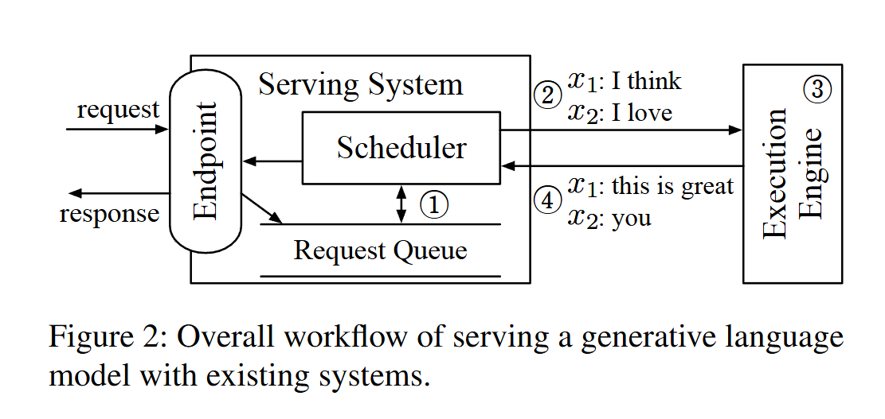

## tinyengine

`tinyengine` is a minimal educational engine that simulates the scheduling and batch execution flow of pre-ORCA LLM serving systems, inspired by Figure 2 in the [ORCA paper](https://www.usenix.org/conference/osdi22/presentation/yu):

## What it includes
- FIFO request admission
- static batching with a configurable `max_batch_size`
- prefill followed by iterative decode
- per-request state and timing metrics (coming soon)
- a benchmark harness for ShareGPT workloads (coming soon)
- small, readable code

## Overall structure

`tinyengine` keeps the serving loop split into a few explicit pieces:

- `RequestQueue`: owns admission order
- `StaticBatchScheduler`: decides which waiting requests enter the next batch
- `HFModelRunner`: wraps the Hugging Face forward path
- `BatchState`: carries tensors and KV cache across decode steps
- `TinyEngine`: ties the loop together

## Paper description

> Figure 2 shows an overall workflow of serving a generative language model
> with existing serving systems and execution engines. The main component of
> the serving system (e.g., Triton [7]) is the scheduler, which is responsible
> for creating a batch of requests by retrieving requests from a queue and
> scheduling the execution engine (e.g., FasterTransformer [4]) to process the
> batch. The execution engine processes the received batch by running multiple
> iterations of the model being served and returns the generated text back to
> the serving system. In Figure 2, the serving system schedules the engine to
> process two requests (`x1: "I think"`, `x2: "I love"`) in a batch, and the
> engine generates `"this is great"` and `"you"` for requests `x1` and `x2`,
> respectively.
