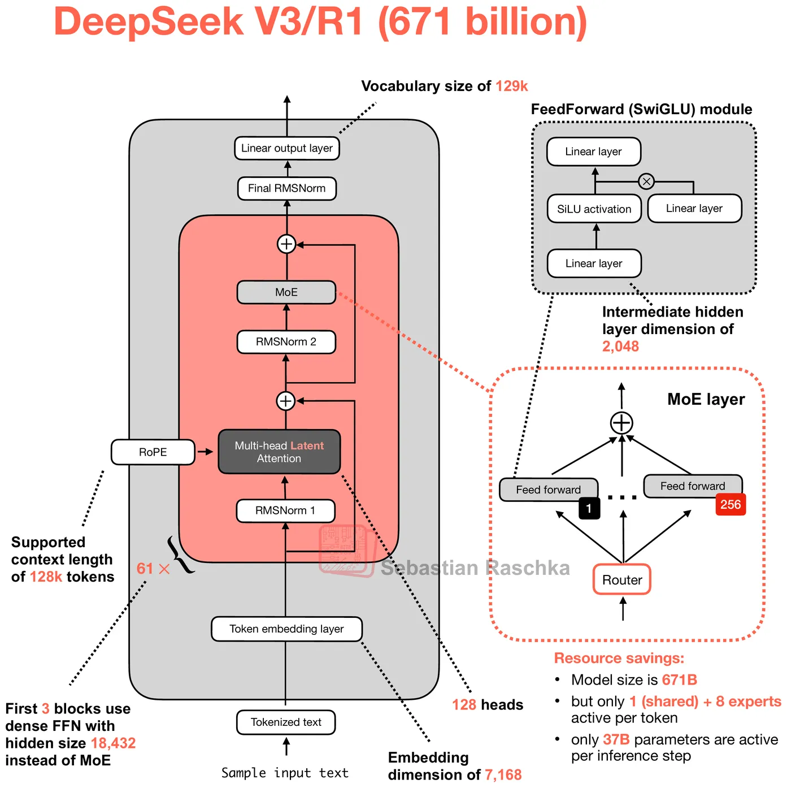
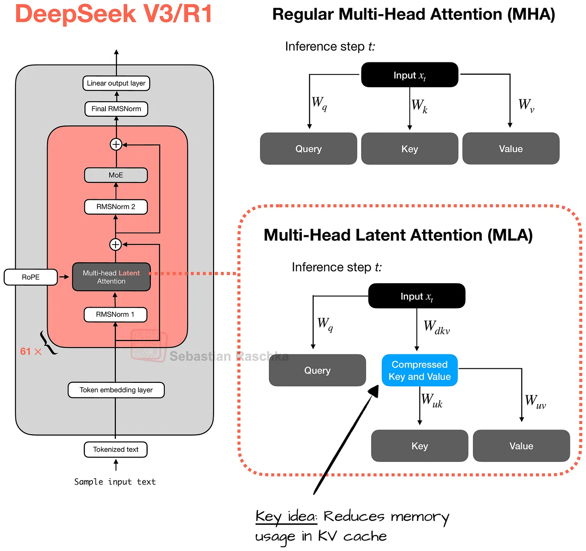
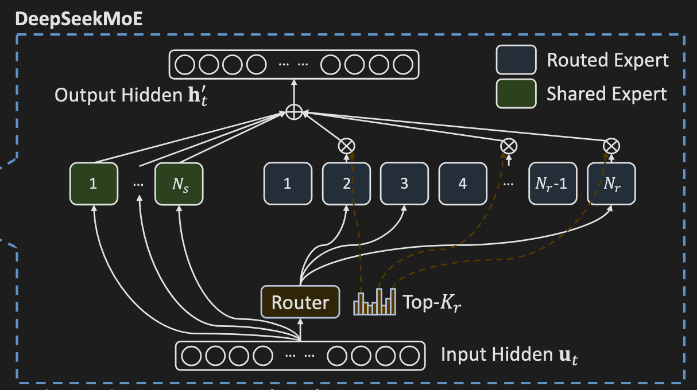

# Overview of DeepSeek V3

  
   
  Figure 1. DeepSeek V3/R1 architecture. Credit: Sebastian Rascha.<a href="#reference-1">[1]</a>

DeepSeek architecture consists 61 Transformer blocks with the first three blocks using dense FFN, and the other 58 blocks using sparse MoE network.

As other transformer based architecture, the two most important components are self attention and feed forward network.

### Multi-Head Latent Attention (MLA)

  
   
  Figure 2. Multi-Head Latent Attention (MLA). Credit: Sebastian Rascha.

DeepSeek V3 uses MLA, which is a variation of Self Attention method, first introduced in DeepSeek V2, where we compress the key and value and then project it to key and value.

MLA uses a linear algebra trick that reduces the amount of KV Cache while also slightly performing better than traditional Multi-Head Attention(MHA). The amount of KV Cache required reduces 2-7x compared to other non-MLA models. This reduces the burden of loading memory.

### DeepSeekMoE

  
   
  Figure 3. DeepSeekMoE.<a href="#reference-2">[2]</a>

For FFN, DeepSeek uses a component called DeepSeekMoE (besides the first three Transformer Blocks). There is a router model of size $[H, E]$ which classifies which experts should process each tokens. While there are MoE methods that send the whole sequence to a single expert, at least for DeepSeek and other models, it routes per token.

In DeepSeek V3.1, the router selects the top eight experts among 256 experts (which is ~3.3%), which is activated and process the tokens. Besides the top 8 experts, there is a shared expert(1) that always get activated for all tokens, which is expected to provide basic and general representation common to all tokens. The output of eight experts and one shared expert (total 9) gets combined and weighted based on the routing scores.

### SwiGLU

Each experts are a small MLP with SwiGLU activation, which is three linear layers:

W1: $[H, M]$
W2: $[M, H]$
W3: $[H,M]$

where $M$ is MoE intermediate size. $M=2048$ and $H=7168$. This contrasts to the traditional dense models like Llama 3.3 70B where the intermediate dimensions are much larger (28,672 vs 8,192). Thus DeepSeek's FFNs are  computationally more efficient.

To summarize, the architecture of DeepSeek V3.1 uses various optimizations such as MLA and DeepSeekMoE which is economically cheaper and efficient compared to dense models.

## References

<ol>
  <li id="reference-1">Sebastian Raschka, "Understanding DeepSeek V3/R1 Architecture." <a href="https://magazine.sebastianraschka.com/p/technical-deepseek">Link</a></li>
  <li id="reference-2">DeepSeek-AI, "DeepSeek-V3 Technical Report." <a href="https://arxiv.org/pdf/2412.19437">Link</a></li>
</ol>
