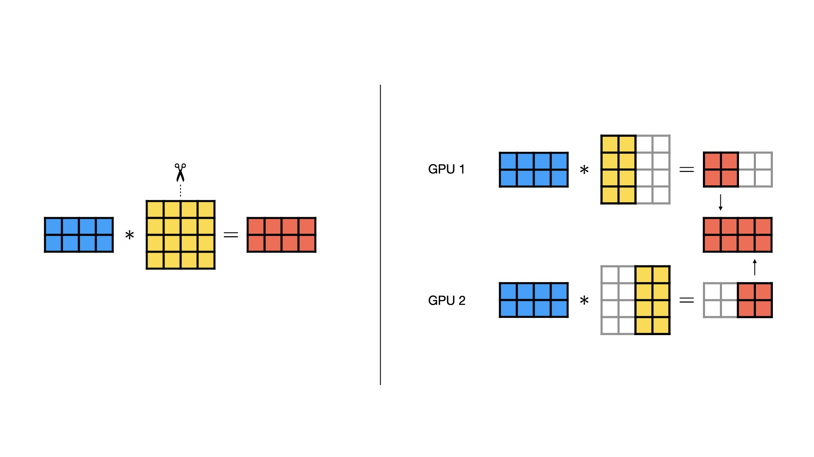
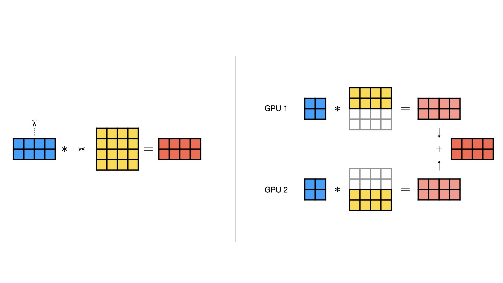
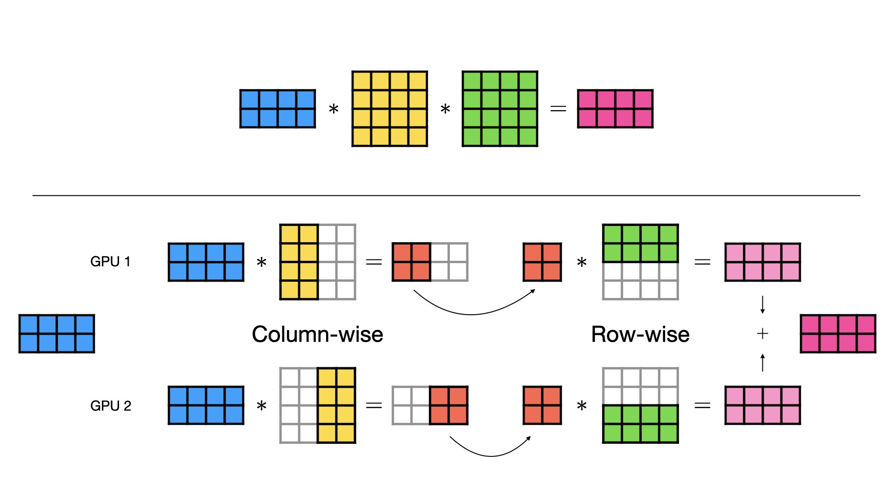

### TP (Tensor Parallelism)

**Tensor Parallelism** (or TP) is one of the most widely used parallelism strategies in LLM inference, especially in single-node multi-GPU serving.

At a high level, TP makes multiple GPUs behave like one larger device for a single model replica. Instead of placing the entire model on every GPU (this is DP), TP shards large tensors inside the model across multiple GPUs. Each GPU, often called a _rank_, stores only a slice of the relevant weights and computes only the corresponding slice of the operation.

The number of GPUs participating in this tensor-parallel group is called `tp_size`.

For example, if `tp_size = 2`, then one model replica is split across two ranks: `TP group = [rank0, rank1]`.

Each rank holds different shards of the model weights. These shards are not independent models but rather they form one logical model together.

### Column Parallelism and Row Parallelism

The representative case in TP is when it is used on linear layers in Transformer architecture, such as QKV projection in self-attention and gated/up projection in FFN. Megatron-LM popularized two core sharding patterns for linear layers in Transformer blocks: column parallelism and row parallelism.<sup><a href="#reference-1">[1]</a></sup>

<p align="center">
  
  <br />
  <sub>Figure 1. Column parallelism (left) and all-gather communication (right).<sup><a href="#reference-2">[2]</a></sup></sub>
</p>

Let's first look at column parallelism.

As an example, suppose we want to compute a matrix multiplication:

`X [B, H] @ W [H, O] -> Y [B, O]`

In column parallelism, the weight matrix is split along the output dimension:

`W [H, O]` is split into `W0 [H, O/2]` and `W1 [H, O/2]`.

Each rank computes a different slice of the output: rank0 computes `Y0 = X @ W0`, and rank1 computes `Y1 = X @ W1`.

The full output is obtained by **concatenating** these independent slices (see the image above):

`Y = concat(Y0, Y1)`

This communication pattern is called **all-gather** ("gathering up") when every rank needs the full concatenated output.<sup><a href="#reference-3">[3]</a></sup>

<p align="center">
  
  <br />
  <sub>Figure 2. Row parallelism and all-reduce communication.<sup><a href="#reference-2">[2]</a></sup></sub>
</p>

In row parallelism, the weight matrix is split along the input dimension:

`X [B, H]` is split into `X0 [B, H/2]` and `X1 [B, H/2]`, while `W [H, O]` is split into `W0 [H/2, O]` and `W1 [H/2, O]`.

Each rank computes a partial contribution to the same output shape: rank0 computes `Y0 = X0 @ W0`, and rank1 computes `Y1 = X1 @ W1`.

These partial results have the same shape as output so they must be summed:

`Y = Y0 + Y1`

This communication pattern is called all-reduce.<sup><a href="#reference-4">[4]</a></sup>


> [!note] Communication intuition
> For now, think of All-Reduce as summing each GPU's local result and copying the sum back to every GPU. All-Gather is closer to concatenating each GPU's local slice and making the concatenated result available to every GPU. I will cover how these collectives are implemented internally, for example in NCCL, in a separate note.

### Column Parallel and Row Parallel in Transformer Block

So how does column parallel and row parallel actually work in the context of Transformer block?

**Self Attention Layer**

Each attention block in Transformer does QKV projection -> Attention computation -> Output Projection.

QKV Projection is usually column-parallel. The fused QKV weight maps hidden states into query, key, and value heads. Its output dimension is roughly `(num_q_heads + 2 * num_kv_heads) * head_dim`.

Column-wise sharding splits that output dimension, so each rank receives only a subset of attention heads.

Since Multi-Head Attention computes attention per head independently, we can do the Attention computation per rank without all-gather communication.

After the attention operation, we use row-parallelism on the output projection `W_O`, whose input dimension is the concatenated attention-head dimension. Since that input is already partitioned by heads, each rank computes only a partial contribution to the final hidden state. The ranks then use All-Reduce to sum these partial outputs and recover the complete hidden state.

**FFN Layer**
Many modern dense MLP blocks use `gate_proj`, `up_proj`, and `down_proj`. The input is projected into two intermediate tensors: one goes through the gate projection and activation, and the other goes through the up projection. These two tensors are multiplied element-wise, then `down_proj` maps the result back to the hidden size.

The `gate_proj` and `up_proj` are usually column-parallel. This is because the FFN usually expands the hidden state into a larger intermediate dimension.<sup>*</sup> For example Qwen3 8B's hidden size is 4,096 while its FFN intermediate size is 12,288 (3x).

The activated gate projection and the up projection are multiplied rank-locally. `down_proj` is row-parallel because it reduces the FFN intermediate activation back to the original hidden size. Each rank produces a partial contribution, and All-Reduce combines those partial outputs into the complete hidden state.

<sup>*</sup> This is not always true. For MoE architecture, the intermediate size of each expert's FFN may be smaller. But for dense models, this is usually the case.


You can see that both attention and FFN follow the same useful pattern:
1. first use a column-parallel projection to create sharded intermediate activations
2. then do as much work as possible rank-locally
3. finally use a row-parallel projection to return to the full hidden size.

Because the intermediate activations are consumed while still sharded, we do not need an all-gather immediately after the column-parallel layer. Instead, the row-parallel layer finishes the block with an all-reduce.

<p align="center">
  
  <br />
  <sub>Figure 3. Column-wise projection followed by row-wise projection. This skips unnecessary All-Gather communication.<sup><a href="#reference-2">[2]</a></sup></sub>
</p>

### Parallelizing Embedding and LM Head

While Transformer blocks take up most of the weights, TP isn't only used in Transformer layers. It is also frequently used to shard large vocab embeddings and LM heads to each rank.

**Vocab Parallel Embedding**

Instead of every rank storing the full token embedding table `[vocab_size, hidden_size]`, each rank stores only a contiguous slice of the vocabulary. For example, with two TP ranks and `vocab_size = 1000`, rank0 may store token ids `0-499` and rank1 may store token ids `500-999`.

> [!note] Vocab sharding vs row parallelism
> A row-wise vocabulary shard is not the same thing as Row Parallelism. Row Parallelism and Column Parallelism describe how we shard matrix multiplication in projection layers. Vocab-parallel embedding and LM head instead shard the vocabulary axis of a lookup/output table.

When a token belongs to a rank’s vocabulary range, that rank looks up the embedding. Other ranks produce zeros for that token. Then the ranks communicate All-reduce to recover the correct embedding output. This process is often called vocab parallel embedding.

**Vocab Parallel LM Head**

The LM head, which is a linear layer that runs after the transformer block loop is finished, can also be tensor-parallelized. It maps the final hidden state `[B, S, H]` to vocabulary logits `[B, S, V]`.

Just like Vocab Parallel Embedding, LM head parallelism shards the vocabulary dimension. The difference is that the LM head uses the vocabulary dimension as the output dimension, so each rank computes logits for only its local vocabulary slice.

So to summarize, tensor parallelism can be thought of a broad strategy of splitting one model replica across multiple ranks. Column parallelism, row parallelism, vocab-parallel embedding, and vocab-parallel LM head are all specific ways TP is applied to different layers of the model.

While Tensor Parallelism reduces duplicated model weights and some intermediate activations, it also adds communication overhead. Especially as `tp_size` gets bigger, the overhead increases. Therefore TP requires high-speed communication to be performant and worth using. Usually TP is used in single-node settings with fast interconnects such as NVLink. We will talk more about what these are in the single-node/multi-node section.

### Case Study: Qwen3 TP in vLLM

vLLM also explicitly mentions that it adopts the sharding techniques introduced in Megatron-LM as well.<sup><a href="#reference-5">[5]</a></sup>

Let's walk through from token embedding to sampling only focusing on how TP is sharded. Assume we had 4 GPUs in one node and used the following command:
```python
vllm serve Qwen/Qwen3-8B --tensor-parallel-size 4
```

**Vocab Parallel Embedding**

For embedding, Qwen3 inherits `VocabParallelEmbedding` and shards the `vocab_size` (151,936 for Qwen3-8B) across the TP world size.

Source: [`VocabParallelEmbedding.__init__`](https://github.com/vllm-project/vllm/blob/8c94938cfb92cc00b244ae4a933c5f60dbc1139f/vllm/model_executor/layers/vocab_parallel_embedding.py#L246)

```python
tp_rank = get_tensor_model_parallel_rank()
```
This gets the tensor-parallel rank for the current process. _rank_ is the local index inside the ProcessGroup.

Source: [`VocabParallelEmbedding.__init__`](https://github.com/vllm-project/vllm/blob/8c94938cfb92cc00b244ae4a933c5f60dbc1139f/vllm/model_executor/layers/vocab_parallel_embedding.py#L247)

```python
self.tp_size = get_tensor_model_parallel_world_size()
```

This gets the tensor-parallel world size (e.g. if TP=4, `tp_size=4`).

Source: [`VocabParallelEmbedding.__init__`](https://github.com/vllm-project/vllm/blob/8c94938cfb92cc00b244ae4a933c5f60dbc1139f/vllm/model_executor/layers/vocab_parallel_embedding.py#L260-L267)

```python
        # Get start/end indices for this TP rank's vocab shard.
        self.shard_indices = self._get_indices(..., tp_rank, self.tp_size)
```

Internally this shards (`divide(self.num_embeddings_padded, self.tp_size)`) the vocab dimension into `tp_size`.

Since vocab is a giant matrix `[V, H]`, where `V` is vocab size and `H` is the hidden dimension, we shard this row-wise.

For example, if `tp_size = 4`, each rank stores a local shard shaped roughly `[V/4, H]`. For a given token id, only the rank that owns that token's vocabulary range produces the real embedding vector; the other ranks produce zeros. vLLM then uses All-Reduce to sum those local outputs, so every rank receives the same embedding vector.

**QKV Parallel Linear**

In the decoder layers (or for each single transformer block) we first shard the attention projection output by head. `QKVParallelLinear` inherits from `ColumnParallelLinear`, so the sharding happens along the output dimension of the QKV projection. Since that output is organized by attention heads, each rank receives only a subset of Q heads.

Source: [`QKVParallelLinear.__init__`](https://github.com/vllm-project/vllm/blob/8c94938cfb92cc00b244ae4a933c5f60dbc1139f/vllm/model_executor/layers/linear.py#L975-L1045)

```python
class QKVParallelLinear(ColumnParallelLinear):
		# ...
		tp_size = get_tensor_model_parallel_world_size() if not disable_tp else 1
		self.num_heads = divide(self.total_num_heads, tp_size)
```

For K and V, vLLM uses a separate variable `total_num_kv_heads` and compares it with the TP size.

Source: [`QKVParallelLinear.__init__`](https://github.com/vllm-project/vllm/blob/8c94938cfb92cc00b244ae4a933c5f60dbc1139f/vllm/model_executor/layers/linear.py#L1027-L1045)

```python
		# ...
        if tp_size >= self.total_num_kv_heads:
	        # Number of KV heads is less than TP size, so we replicate
            # the KV heads across multiple tensor parallel GPUs.
            self.num_kv_heads = 1
            self.num_kv_head_replicas = divide(tp_size, self.total_num_kv_heads)
        else:
	        # Number of KV heads is greater than TP size, so we partition
            # the KV heads across multiple tensor parallel GPUs.
            self.num_kv_heads = divide(self.total_num_kv_heads, tp_size)
            self.num_kv_head_replicas = 1
```

Since Qwen3 uses GQA (Grouped-Query Attention), it uses the same KV for multiple Q heads (e.g. 1 KV head shared among 4 Q heads in Qwen3-8B). So for KV, vLLM may either partition KV heads or replicate them across ranks.

If KV heads are greater than or equal to the TP rank size, vLLM partitions KV heads across ranks. But since GQA usually has fewer KV heads than Q heads, KV heads may be smaller than TP size. In that case, vLLM replicates KV heads across multiple ranks instead of splitting a single head.

For example, if `total_num_kv_heads = 2` and `tp_size = 4`, the KV heads cannot be partitioned into four distinct head shards. vLLM makes each rank hold one KV head, and the same KV head is shared by two ranks. In other words, Q heads are partitioned four ways, while KV heads use a mix of partitioning and replication.

Note that in the replication case, KV heads are duplicated across ranks, so TP gives less memory saving for the KV projection weights and KV cache in this part. This will be addressed again later.

So each rank gets a subset of Q heads and either a subset or a duplicate copy of KV heads.

No all-gather is needed here because the next row-parallel projection consumes the sharded attention output directly.


**RowParallelLinear**

Source: [`RowParallelLinear`](https://github.com/vllm-project/vllm/blob/8c94938cfb92cc00b244ae4a933c5f60dbc1139f/vllm/model_executor/layers/linear.py#L1392-L1559)

```python
class RowParallelLinear(LinearBase)::
		# ...
		# input_size is the first dimension (row) of the weight matrix
		self.input_size_per_partition = divide(input_size, self.tp_size)
	# ...
	def forward(...):
	# Matrix multiply.
	if self.reduce_results and self.tp_size > 1:
		# All-Reduce
		output = tensor_model_parallel_all_reduce(output_parallel)
```

As you can see, we only shard the weight matrix `W_O` because the input tensors are already sharded from QKV projection. After each rank multiplies its local attention output with its local shard of `W_O`, vLLM runs all-reduce to sum the result from each local rank.

**MergedColumnParallelLinear and RowParallelLinear**

Source: [`Qwen2MLP`](https://github.com/vllm-project/vllm/blob/8c94938cfb92cc00b244ae4a933c5f60dbc1139f/vllm/model_executor/models/qwen2.py#L83-L117)

```python
class Qwen2MLP(nn.Module):
    def __init__(...):
        # gate_proj and up_proj are fused into one column-parallel layer.
        self.gate_up_proj = MergedColumnParallelLinear(...)
        # down_proj maps the intermediate activation back with row parallelism.
        self.down_proj = RowParallelLinear(...)
        self.act_fn = SiluAndMul()

    def forward(self, x):
        gate_up, _ = self.gate_up_proj(x)
        x = self.act_fn(gate_up)
        x, _ = self.down_proj(x)
        return x
```

Again we can see a similar pattern in the FFN layer (Qwen3MLP inherits Qwen2MLP directly) where up and gate projection use column parallelism and down projection uses row parallelism.

Source: [`MergedColumnParallelLinear`](https://github.com/vllm-project/vllm/blob/8c94938cfb92cc00b244ae4a933c5f60dbc1139f/vllm/model_executor/layers/linear.py#L607-L729)

> [!note] MergedColumnParallelLinear vs QKVParallelLinear
> Both layers are column-parallel, but they solve different loading and sharding problems.
>
> `MergedColumnParallelLinear` is the generic fused version. It packs multiple projections along the output dimension, then shards each packed projection separately while loading weights. This fits the MLP case well because `gate_proj` and `up_proj` have the same input shape and the same intermediate output size.
>
> `QKVParallelLinear` also packs several projections, but attention has extra structure. Q, K, and V are grouped by heads; Q heads and KV heads may have different counts in GQA/MQA-style models; and when `tp_size` is larger than the number of KV heads, vLLM must replicate KV heads instead of splitting a single head.
>
> So `QKVParallelLinear` reuses the column-parallel forward path, but adds attention-specific head sharding and weight-loading logic. `MergedColumnParallelLinear` is enough for the MLP because its two projections are just same-shaped output shards, without head-level rules.

**ParallelLMHead**

The last step before sampling is to turn the final hidden state into vocab logits. In vLLM, this part is also vocab-parallelized.

Source: [`Qwen3ForCausalLM.compute_logits`](https://github.com/vllm-project/vllm/blob/8c94938cfb92cc00b244ae4a933c5f60dbc1139f/vllm/model_executor/models/qwen3.py#L328-L333)

```python
def compute_logits(self, hidden_states: torch.Tensor):
    logits = self.logits_processor(self.lm_head, hidden_states)
    return logits
```

Inside `LogitsProcessor`, each rank multiplies the final hidden states with its local shard of the LM head weight. So with `tp_size = 4`, each rank produces logits for roughly `V / 4` vocabulary entries, not the full vocabulary.

Source: [`LogitsProcessor._get_logits`](https://github.com/vllm-project/vllm/blob/8c94938cfb92cc00b244ae4a933c5f60dbc1139f/vllm/model_executor/layers/logits_processor.py#L89-L104)

```python
logits = lm_head.quant_method.apply(lm_head, hidden_states, bias=embedding_bias)

# Gather logits for TP
logits = self._gather_logits(logits)
```

Then vLLM gathers vocab shards across the TP group. Depending on the platform, it uses gather or all-gather. After the gather, vLLM removes vocab padding and returns the full logits tensor used by the sampler.<sup><a href="#reference-6">[6]</a></sup>


### References

<p id="reference-1">[1] Shoeybi et al. <a href="https://arxiv.org/abs/1909.08053">Megatron-LM: Training Multi-Billion Parameter Language Models Using Model Parallelism</a>.</p>
<p id="reference-2">[2] Lightning AI. <a href="https://lightning.ai/docs/pytorch/stable/advanced/model_parallel/tp.html">Tensor Parallelism</a>.</p>
<p id="reference-3">[3] NVIDIA NCCL Documentation. <a href="https://docs.nvidia.com/deeplearning/nccl/user-guide/docs/usage/collectives.html#allgather">AllGather</a>.</p>
<p id="reference-4">[4] NVIDIA NCCL Documentation. <a href="https://docs.nvidia.com/deeplearning/nccl/user-guide/docs/usage/collectives.html#allreduce">AllReduce</a>.</p>
<p id="reference-5">[5] vLLM Team. <a href="https://vllm.ai/blog/2025-02-17-distributed-inference">Distributed Inference in vLLM</a>.</p>
<p id="reference-6">[6] NVIDIA NCCL Documentation. <a href="https://docs.nvidia.com/deeplearning/nccl/user-guide/docs/usage/collectives.html#gather">Gather</a>.</p>
