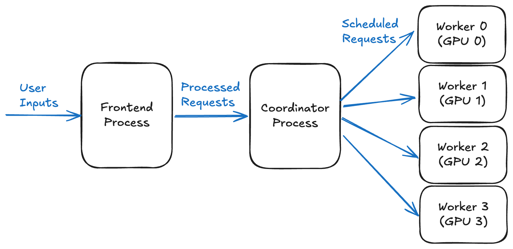
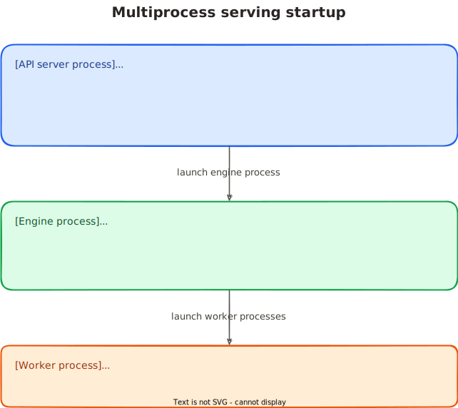
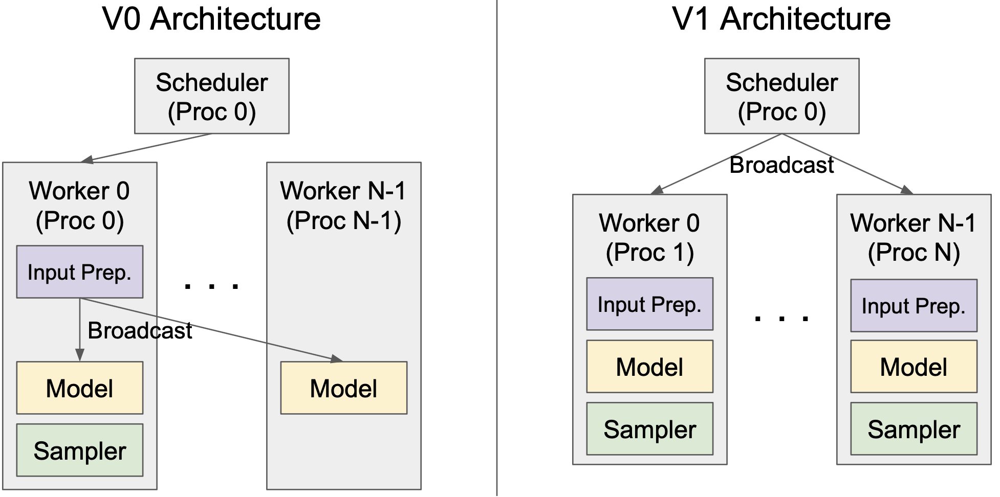

# How Multiprocess Serving Works in vLLM

This post traces the current V1 multiprocess serving path in vLLM: how online serving starts, how each process connects, and how requests move through the runtime.

>This article is aligned with commit `a4905133f375ec721be441e7ec4a3f923daa28f3` (2026-04-22). Since vLLM moves fast, I will update this (or write a new post) when architecture changes.

The focus is OpenAI-compatible online serving through `vllm serve`.

# Why Multi Process?

<p align="center">
  
  <br />
  <sub>Figure: online serving with 1 API server process, 1 Engine process, and 4 Worker processes.<sup><a href="#reference-1">[1]</a></sup></sub>
</p>

vLLM's design documents describe three process types:

1. API Server process
2. Engine Process
3. Worker Process

The split follows the work each process owns. The API server handles request-facing CPU work, the engine process owns scheduling, and worker processes own rank-local GPU execution state. Part 2 follows each process in the serving path.

### CPU Resources

The minimum CPU requirement can be written as:
$$\text{minimum CPU Cores} = 1 + 1 + N\text{(number of GPU workers)}$$
so we need at least $2 + N$ physical CPU cores to avoid performance loss. In practice, leave extra CPU headroom because the OS and other services also need CPU time.<sup><a href="#reference-2">[2]</a></sup>

If we scale to multiple API servers with DP and the DP coordinator enabled, it can be written as:
$$\text{CPU Cores} = A + DP + N + 1$$

The $1$ at the end of the equation is for the DP coordinator process, which manages load balancing across DP ranks, so all DP ranks stay in sync and efficiently handle requests.

For example, 4 API Servers with `DP=4` and `TP=2`, `PP=2` would need $4 + 4 + 16 + 1 = 25$ CPU cores.

With the process roles and CPU cost in place, the next step is engine startup.

Part 1 and Part 2 use the common single-server, async, multiprocess, no-DP scenario. ~~A later version will extend this to multi-API server and DP~~ (WIP).

# Part 1. How Process Startup Works

> Note: this startup path has a lot of plumbing, but it matters for understanding where each process comes from.

When we run `vllm serve`, four things happen:
1. the API side prepares backend launch
2. the engine process launches and handshakes back
3. the engine initializes worker processes
4. the system starts serving

The diagram below shows the startup process:
<p align="center">
  
</p>

The next sections follow those steps in order.

## 1. API server process starts and prepares backend launch

```text
API server process starts
  -> decides how later child processes will be created (`fork` / `spawn` / `forkserver`)
  -> builds `AsyncLLM`
  -> builds engine client (`AsyncMPClient` with no DP)
```

For online serving (`vllm serve`), the common entrypoint is `build_async_engine_client(...)` in `api_server.py`. This starts the API server, or frontend, process.

Before any child process exists, two things happen:
1. the API server chooses how child processes will be created by `VLLM_WORKER_MULTIPROC_METHOD`
2. the API server builds the client-side objects it will use to talk to the engine

### Choosing a start method: `fork`, `spawn`, and `forkserver`

>[!Note] Note
>Since Python multiprocessing configuration design documentation<sup><a href="#reference-3">[3]</a></sup> has been deprecated since December 2024, I will write in terms of the current state.

Before launching child processes, vLLM decides which multiprocessing start
method to use. Python supports three relevant methods:

- **`fork`** copies the parent process memory into the child. This method is fast, but unsafe once the parent has initialized accelerator runtime state such as CUDA or XPU, entered a Ray actor, enabled NUMA subprocess handling, or reached other states where forking is unreliable.
- **`spawn`** starts a fresh Python interpreter. It is slower than `fork`, but is the safer option when the parent process may already contain accelerator or other non-fork-safe state.
- **`forkserver`**: vLLM has a narrow OpenAI API server startup branch for forkserver preload, but it is not the normal supported worker start method in current V1. The worker multiprocessing context accepts `fork` and `spawn`.

For `vllm serve`, the CLI normally sets `spawn`. Library usage usually starts with the `fork` method.

### Building `AsyncLLM` and the engine client

In `api_server.py`, `build_async_engine_client_from_engine_args(...)` first builds `VllmConfig`, then constructs `AsyncLLM` from it.

```python
# vllm/entrypoints/openai/api_server.py
vllm_config = engine_args.create_engine_config(usage_context=usage_context)
# ...
try:
	async_llm = AsyncLLM.from_vllm_config(
	    vllm_config=vllm_config,
	    # ...
	)
```

`AsyncLLM` is the object the API server calls after HTTP-side preprocessing is done. It owns the input/output processors and the `EngineCoreClient`, so it is the API process's handle to the backend serving runtime.

Inside `AsyncLLM`, the API side asks for a multiprocess engine client. In the baseline no-DP case, that factory returns `AsyncMPClient`, the asynchronous multiprocess client.

> [!NOTE] **AsyncLLM vs AsyncMPClient**
> **AsyncLLM** is the public async engine layer which accepts requests, manages streaming outputs, aborts, errors, stats, and the API-facing lifecycle.
> **AsyncMPClient** is the lower transport layer which directly communicates with the separate EngineCore process over ZMQ and moves inputs/outputs across that boundary.

```python
# vllm/v1/engine/core_client.py
if parallel_config.data_parallel_size > 1:
    if parallel_config.data_parallel_external_lb:
        return DPAsyncMPClient(*client_args)
    return DPLBAsyncMPClient(*client_args)
# no DP case
return AsyncMPClient(*client_args)
```

## 2. The engine process launches and handshakes back

```text
API server process
  -> engine client (`AsyncMPClient`)
      -> allocates client <-> engine ZMQ addresses
      -> launches engine process(es)
      -> waits for startup and input-socket readiness
```

After `AsyncLLM` creates `AsyncMPClient`, the client does three things:
1. choose client <-> engine ZMQ addresses
2. launch the managed `EngineCore` process set
3. wait for the startup handshake to finish

The address setup and startup handshake are the two pieces to watch.

### Choosing ZMQ addresses

> [!Note] What is ZMQ?
> ZeroMQ (ZMQ) is a high-performance messaging library that provides sockets for communication between processes, machines, or threads without needing a traditional message broker.<sup><a href="#reference-4">[4]</a></sup>

`AsyncMPClient` inherits most of its startup behavior from `MPClient` (base client for both async and sync clients).

The EngineCoreClient owns the startup of the actual EngineCore process. During MPClient initialization, it spawns `EngineCoreProc.run_engine_core` using the multiprocessing context chosen earlier (`fork` or `spawn`).

There are two types of addresses: IPC and TCP. If the engine is local, the addresses are usually IPC paths, meaning both processes talk through a Unix-domain socket on the same node. If the route crosses nodes, vLLM uses TCP addresses instead.

```text
IPC: same node
API server process -> ipc:///tmp/vllm-xxx/input.sock -> local EngineCore process

TCP: cross-node / distributed DP
frontend on node-0 -> tcp://10.0.0.5:14567 -> EngineCore or DP peer on node-1
```

### Startup Handshake

When the frontend owns the engine startup, it launches local engine processes and waits until each engine reports that it is ready.

vLLM uses a small startup handshake socket to avoid sending requests to processes that exist but are still initializing (`HELLO` -> `READY`).

```python
# vllm/v1/engine/utils.py
context.Process(
    target=EngineCoreProc.run_engine_core,
    name="EngineCore",
    kwargs=common_kwargs | {"dp_rank": global_index},
)
```

## 3. The engine initializes worker processes

```text
engine process
  -> creates `MultiprocExecutor`
      -> sets up worker-side IPC
      -> launches worker processes
worker processes
  -> initialize device/model state
  -> publish `READY`
```

Inside the EngineCore process, `EngineCore.__init__` creates the configured `executor_class`, usually `MultiprocExecutor` if there is more than 1 GPU.

`MultiprocExecutor` is the engine-side owner of the worker process lifecycle, which spawns `WorkerProc` processes and exposes worker operations back to the rest of EngineCore.

```python
# vllm/v1/engine/core.py
self.model_executor = executor_class(vllm_config)
if executor_fail_callback is not None:
	self.model_executor.register_failure_callback(executor_fail_callback)
```

EngineCore remains the single scheduling point. It decides which requests are accepted, batched together, aborted, or advanced to the next step.

After scheduling, execution fans out to local workers. In most GPU setups, there is one worker process per local GPU.

> Note: A _local rank_ is the worker's index on a node. For example, on a node with 4 local GPUs, the workers have `local_rank` 0, 1, 2, and 3.

### Worker Process Startup

A worker process has its own startup sequence before it can run model work: setting up local runtime/device state and loading the model.

`MultiprocExecutor` starts each worker with two one-way pipes.
The **ready pipe** lets the child tell the parent that startup finished. The parent waits on this pipe before treating the worker as usable. The **death pipe** goes the other direction. The parent keeps one end open, and the child watches the other end so it can detect when the parent process disappears.

```python
# vllm/v1/executor/multiproc_executor.py
ready_reader, ready_writer = context.Pipe(duplex=False)
death_reader, death_writer = context.Pipe(duplex=False)

proc = context.Process(
    target=WorkerProc.worker_main,
    kwargs={
        "local_rank": local_rank,
        "rank": rank,
        "ready_pipe": ready_writer,
        "death_pipe": death_reader,
    },
    name=f"VllmWorker-{rank}",
)
```

# Part 2. How Serving Works

Before following the request path, here is how the three process roles map to the steady-state serving loop.

### API Server Process

The API Server Process is the user-facing endpoint. It handles CPU work such as HTTP handling, tokenization, preprocessing, and streaming.

As GPU execution gets faster, CPU work can become the bottleneck: API handling, scheduling, input preparation, and output processing.

Multimodal inputs make this worse because image and audio payloads need preprocessing before they reach the engine. For example, a single 1024x3072 image is around ~9 MB when represented as an int8 array.<sup><a href="#reference-1">[1]</a></sup>

Splitting the API server from the engine lets CPU-side request handling overlap with engine scheduling and GPU execution. Expensive preprocessing is less likely to leave the GPU idle.

vLLM also uses Shared Memory IPC Caching for multimodal data, reducing redundant copies when large payloads cross the IPC boundary.

The default number of API Server processes is one. If API-side work becomes the bottleneck relative to scheduling or model execution, `vllm serve --api-server-count <number>` adds more API server processes.

### Frontend -> EngineCore

The API process handles request-facing work: tokenization, prompt shaping, multimodal preprocessing, and output formatting. `AsyncLLM` keeps API-side output state in `OutputProcessor`, then sends an `EngineCoreRequest` to the engine process through `EngineCoreClient`.

The frontend boundary uses ZMQ because it carries heterogeneous control messages such as `ADD`, `ABORT`, and `UTILITY`, and because it has to work across local IPC, multiple API workers, and distributed DP layouts.

### Engine Process

The engine process schedules incoming requests from the API server: admission, batching, aborts, output routing, and related state transitions.

V1 isolates the `EngineCore` execution loop so request handling, preprocessing, scheduling, and model execution can overlap instead of contending inside one process.<sup><a href="#reference-5">[5]</a></sup>

Batches of requests are scheduled and sent to workers at the iteration level. This post does not cover continuous batching itself; Anyscale's continuous batching article is a useful background reference.<sup><a href="#reference-6">[6]</a></sup>

DP (Data Parallelism) can scale the number of EngineCore processes. DP replicates the full model weights across multiple GPU sets and processes independent request batches in parallel. Without DP, there is one Engine Process.

### Inside EngineCore

The engine process receives frontend messages, converts them into internal commands, and pushes them into `input_queue`.

The main engine loop repeatedly does two things:
1. process input queue
2. process engine step

```python
def run_busy_loop(self):
    while self._handle_shutdown():
        self._process_input_queue()
        self._process_engine_step()
```

`EngineCore` is the single scheduling point which accepts requests, handles aborts, batches work, advances decode/prefill state, and decides when model execution is needed.

### Worker Process

The worker process manages the GPU work needed to generate the next token for a scheduled batch.

Worker Process owns model weights, KV cache pages, communicator state, CUDA graphs, and rank-local buffers.

<p align="center">
  
  <br />
  <sub>Figure: Engine (Scheduler) broadcasts to $N$ Workers.<sup><a href="#reference-5">[5]</a></sup></sub>
</p>

Usually there is one Worker per GPU, and the number of Workers scales with the TP and PP configuration. For example, PP=2 with TP=4 needs 8 GPUs, so vLLM starts 8 worker processes.

Collapsing these roles into fewer processes would mix request handling, scheduling, and rank-local GPU state in one runtime. That makes latency less predictable and lowers throughput.

### EngineCore -> Workers

When execution is needed, `EngineCore` calls the executor. In the multiprocess executor path, this becomes a broadcast-style RPC to local workers:

```python
def execute_model(self, scheduler_output, non_block=False):
    return self.collective_rpc(
        "execute_model",
        args=(scheduler_output,),
        unique_reply_rank=self.output_rank,
    )
```

Workers run the scheduled requests on already-initialized local devices and return results through the executor response path.

### Return Path
The return path runs in reverse. Worker replies are collected by the executor, converted by `EngineCore` into `EngineCoreOutputs`, sent back over the frontend ZMQ output path, and converted by `OutputProcessor` into streamed or final API responses.

### Why does EngineCoreClient <-> EngineCore use ZMQ unlike EngineCore <-> Worker using MQ and pipe?

The EngineCoreClient <-> EngineCore boundary uses ZMQ, while the Engine <-> Worker boundary uses shared-memory (`shm`) MQs (`MessageQueue`s) and pipes. Since shared memory is usually faster than ZMQ, why does the upper boundary use ZMQ?

The frontend-to-engine control boundary needs `ROUTER`/`PULL` messaging, which ZMQ supports, across local IPC, multiple API workers, and distributed DP layouts.

The frontend sends relatively small payloads: request metadata, token IDs, control commands, and output metadata. ZMQ fits that boundary well.

<p align="center">
  
  <br />
  <sub>Figure: Multiple API servers with multiple Engine Cores</sub>
</p>

The engine-to-worker path is different. One `EngineCore` usually controls many local workers, so it needs broadcast-style communication. It also sends heavier execution data, such as scheduler outputs, block tables, and tensor-related payloads. For that path, vLLM uses the executor's multiprocessing communication layer instead of ZMQ. A vLLM PR notes that shared-memory broadcast was more efficient than ZMQ on the single-node engine-to-worker IPC path.<sup><a href="#reference-7">[7]</a></sup>


## References
<ol>
  <li id="reference-1">vLLM Blog, "Efficient Multi-Modal Data Transfer in vLLM Using Shared Memory IPC Cache." <a href="https://vllm.ai/blog/shm-ipc-cache">Link</a></li>
  <li id="reference-2">vLLM Docs, "Optimization and Tuning." <a href="https://docs.vllm.ai/en/latest/configuration/optimization/">Link</a></li>
  <li id="reference-3">vLLM Docs, "Multiprocessing." <a href="https://docs.vllm.ai/en/stable/design/multiprocessing/">Link</a></li>
  <li id="reference-4">ZeroMQ. <a href="https://zeromq.org/">Link</a></li>
  <li id="reference-5">vLLM, "vLLM V1: A Major Upgrade to vLLM's Core Architecture." <a href="https://vllm.ai/blog/v1-alpha-release">Link</a></li>
  <li id="reference-6">Anyscale, "Continuous Batching LLM Inference." <a href="https://www.anyscale.com/blog/continuous-batching-llm-inference">Link</a></li>
  <li id="reference-7">vLLM PR #5755, "Use shared memory broadcast for multiproc executor." <a href="https://github.com/vllm-project/vllm/pull/5755">Link</a></li>
</ol>
