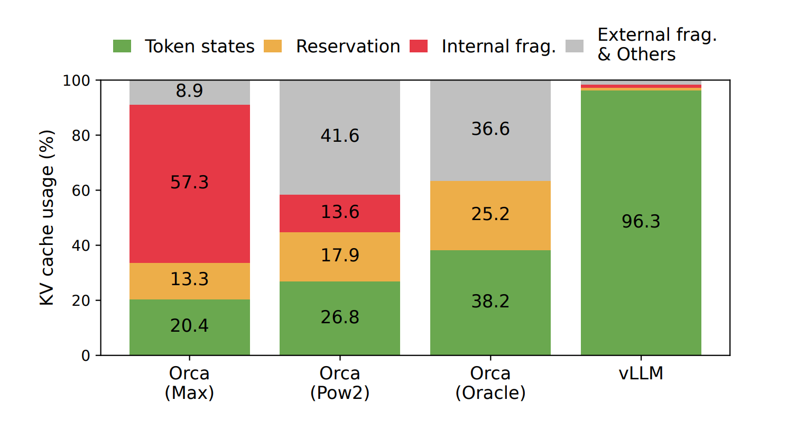
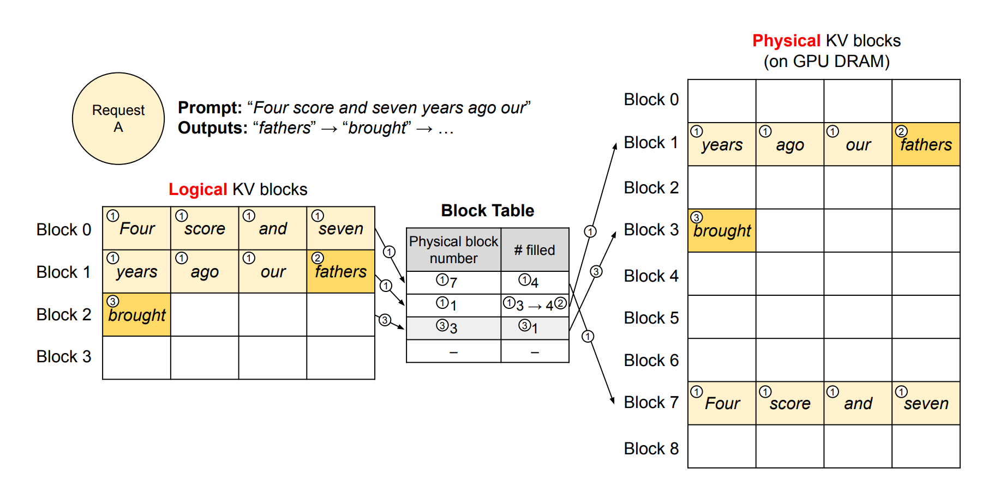
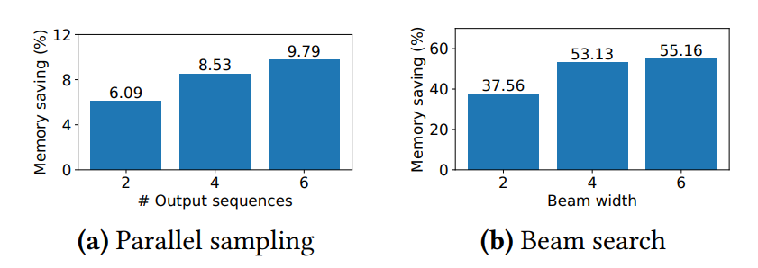
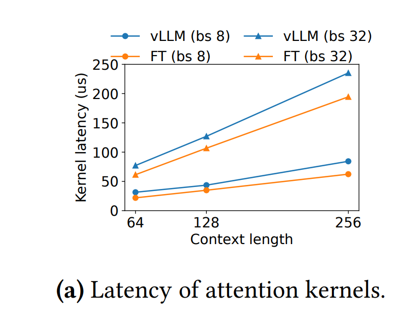

# PagedAttention

Notes after reading _Efficient Memory Management for Large Language Model Serving with PagedAttention_ & additional contents about it.<a href="#reference-1">[1]</a>

## Background

PagedAttention and vLLM came out of UC Berkeley's Sky Computing Lab. vLLM was publicly announced on June 20, 2023, and the PagedAttention paper followed on arXiv on September 12, 2023.<a href="#reference-2">[2]</a>

One year before that, ORCA was published, which introduced iterative scheduling and selective batching. ORCA was one of the first papers to focus on how to coordinate multiple requests more efficiently instead of naively making computation (kernels) faster.<a href="#reference-3">[3]</a>

While iterative scheduling improved compute-side utilization, it didn't address efficient usage of memory for KV cache storage.

In ORCA, when the scheduler allocated new requests to memory, it always allocated (initial prompt length + maximum output length), for example KV cache for initial prompt len + 2,048 tokens.<a href="#reference-3">[3]</a>

While this sounds naive, it also makes sense because for transformer-based language models, generation is autoregressive and we do not know in advance how many tokens the model will generate. By preallocating the maximum output length for each request that runs on the next step, we can make sure there are no out-of-memory cases and batch requests safely.

However the vLLM team found this approach "too conservative" due to three kinds of inefficiency in memory allocation.<a href="#reference-1">[1]</a>

1. **reservation**: the tokens to be generated but since the scheduler "preallocates" the memory space, it is reserved and considered to be used when it actually isn't.

2. **internal fragmentation**: scheduler allocates maximum output length per request and many requests (depends on the workload but generally) will reach `<eos>` token before maximum length. The rest of the space are not used but still allocated. For example when we set max token to 2048 but a request only decodes 3 tokens and reach `<eos>`, we are not using the 2045 token but still allocated it.

3. **external fragmentation**: External fragmentation is when we could allocate memory if we summed up all the empty spaces, but cannot because those spaces are fragmented. This is more like a side effect as requests grow and finish over time. Ideally, we want to use memory as efficiently as possible by placing one request's KV memory right after the previous request. However, due to iterative batching, requests finish and get freed on different timelines, and over time this creates "holes."
The most intuitive example is this: say we batched four requests with max token length and requests 2 and 4 finished early. We want to batch request 5 and technically we can if we add up the memory space for requests 2 and 4, but because request 5's prompt length is bigger than either individual hole, we cannot schedule request 5.

Eventually, the memory does get freed after the request finishes, but it is still inefficient because:
1. it stays reserved at the maximum length for the whole lifetime of the request, so other requests cannot use that space even when it is idle at a given step
2. once the request is removed, it can still leave behind fragmentation that hurts future scheduling

The table presented in the paper shows how bad ORCA was in using memory:

  
   
  Figure 1. Average percentage of memory waste in different LLM serving systems.<a href="#reference-1">[1]</a>

## What PagedAttention is trying to solve

While it may sound obvious, I think it's still important to define exactly what problem the solution is trying to solve, in a more explicit way, especially in inference engineering where the bottlenecks are often mixed together.

I really like this image, inspired by Figure 1 of the PagedAttention paper, because it makes the objective very clear.

  
   
  Figure 2. Remaining HBM headroom that can be used for KV cache after accounting for model weights and small activation overhead.<a href="#reference-4">[4]</a>

As explained in the llm inference intro article, during inference we largely need three things on HBM: model weights, activation overhead, and KV cache.<a href="#reference-4">[4]</a>

Activation overhead is relatively small and ephemeral, and model weight is not something we can change unless we switch or quantize the model. This means if we want to serve the same model, the main thing we can optimize is how efficiently we use the remaining memory.

_What does it mean to use the leftover memory as efficiently as possible?_

It means batching wisely.

Since the leftover memory is used only for KV cache, the more sequences we can fit, the bigger batch size we can make, the more work we can load for each step, and the better we can utilize the GPU.

So PagedAttention tries to use the leftover memory better -> make bigger decode batches -> produce more tokens per step -> ultimately improve throughput.

If we say ORCA mainly addressed scheduling inefficiency, PagedAttention mainly addressed memory management, especially for KV cache. Efficient memory usage is still an active area, extending into KV-cache pruning, KV quantization, compaction, and more.

## PagedAttention

The solution is quite simple and intuitive to understand.

For the available memory, we divide the contiguous memory into blocks of size $B$.
We then introduce two types of blocks of the same size: logical blocks in the scheduler's view of the sequence, and physical blocks on the GPU, which store the KV cache. The logical blocks are contiguous in sequence order. The GPU's physical blocks are contiguous only within each block and can be non-contiguous with one another.
The block table maps the logically contiguous block sequence to physically non-contiguous GPU blocks.

  
   
  Figure 3. Block table connecting logically contiguous KV blocks to non-contiguous physical KV blocks on the GPU.<a href="#reference-1">[1]</a>

How does this work?

KV cache is built during prefill and then reused during decode. To multiply the current query vector with the past K and V matrices, we first retrieve the appropriate KV blocks for each request. The PagedAttention kernels gather those blocks, compute attention block by block, and then combine the partial results. This is computationally equivalent to multiplying against one big contiguous KV matrix, because the per-block dot products are independent and can be accumulated into the same final attention result.

Mathematically, it can be represented as follows:

$$
A_{ij} = \frac{\exp(q_i^\top K_j / \sqrt{d})}{\sum_{t=1}^{\lceil i / B \rceil} \exp(q_i^\top K_t / \sqrt{d})},
$$

$$
o_i = \sum_{j=1}^{\lceil i / B \rceil} V_j A_{ij}^\top.
$$

Here, $i$ is the current token position we are decoding, $B$ is the block size, and $j$ indexes the KV blocks that belong to the sequence.

Since a sequence of length $i$ spans $\lceil i / B \rceil$ blocks, the kernel computes attention against each block separately and then combines the partial results. So while the block table changes where the KV cache is stored physically, it does not change what attention computes mathematically.

## Why blocks are good

By dividing memory into blocks, we solve the three problems above:
1. during decode, we reserve only one more block when the request needs more tokens, so reservation is bounded by the size of one block
2. internal fragmentation may still happen if generation stops in the middle of a block, but it is also bounded by the size of one block
3. there is no external fragmentation because blocks are logically contiguous and the block table can connect them to non-contiguous physical blocks

While PagedAttention is clearly a success overall, one thing to note is the overhead of the PagedAttention kernel:

  
   
  Figure 4. PagedAttention kernel latency compared with a contiguous-cache baseline.<a href="#reference-7">[7]</a>

The tradeoff is that the PagedAttention kernel itself can have noticeably higher attention-kernel latency than a simpler contiguous-cache kernel due to the extra indirection and gather logic; the talk cited here reports roughly **20-26%** overhead in one comparison.<a href="#reference-7">[7]</a>

In practice this overhead is outweighed by the much larger batch sizes enabled by better KV-cache utilization, so end-to-end throughput still improves substantially.

## Tradeoff of block size

Block size mainly affects three things:
1. lookup overhead: the overhead of managing the lookup table and kernel logic to find the physical KV block. The smaller the block size is, the more blocks get created and the more blocks there are to manage.
2. amount of KV cache that can be shared: The smaller the block size is, the higher the probability that requests can share larger fractions of a prefix. For example, if two requests share 15 tokens and the block size is 16, there is no full block to share, but if the block size is 4, they can share 3 blocks (12 tokens).
3. internal fragmentation: The smaller the block size is, the less unused tail space we waste when a sequence stops in the middle of a block. Larger blocks reduce lookup overhead, but they increase this bounded waste.

## Parallel Sampling & Beam Search

As noted, KV cache can be shared across multiple requests. For system prompts or code suggestions, for example, different requests may share the same prefix and diverge only later. This sharing is made possible by reference counts, where the count grows as more requests share the same block(s).

Beam search is a decoding method that keeps the top-$k$ partial candidates at each step instead of greedily keeping only one. It is older than LLM serving itself; for neural text generation, a commonly cited early reference is _Sequence to Sequence Learning with Neural Networks_ by Sutskever, Vinyals, and Le (2014), which used beam search during decoding.<a href="#reference-5">[5]</a>

Using beam search requires a lot of memory allocation for what is conceptually still one request, which made it inefficient in older frameworks. However because vLLM can allocate and deallocate blocks much more flexibly, it can free the blocks of dead candidates quickly and reuse that space.

Copy-on-write means multiple candidates can point to the same physical KV blocks as long as they still share the same prefix.

No copying is needed at that stage. We only increase the reference count. Once one candidate appends a token that makes it diverge from the others, the next write cannot safely modify the shared block in place.

At that moment, vLLM allocates a new physical block for the diverging candidate and writes there instead.

The natural counter term is just an in-place write: if a block is not shared, we can keep appending to that candidate's own block directly.

So the big idea is:

1. shared prefix -> share physical blocks by reference count
2. divergence happens -> allocate a new block only for the branch that diverged
3. dead beam candidates -> free their blocks immediately

  
   
  Figure 5. Prefix-sharing and copy-on-write behavior for parallel sampling or beam search under block-based KV-cache management.<a href="#reference-8">[8]</a>

## Preemption

Preemption was confusing to me at first, because it sounded like the scheduler is replacing a running request with a waiting request on purpose. That framing is a bit misleading.

The key point is that decode is autoregressive, so memory demand is not fixed after the first scheduling decision(first blocks allocated). A batch may fit in GPU memory at step $t$, but at step $t+1$ several running sequences may all need one more KV block at the same time. If there is no free block left, the engine has to do something immediately in order to keep decoding.

This is when we use preemption. vLLM can preempt some request state to free KV-cache space for the rest of the running batch, and then resume or recompute that work later depending on the preemption mode.

In the current docs, vLLM describes preemption as a mechanism used when "KV cache space is insufficient to handle all batched requests" and notes that preempted requests are handled later once memory becomes available again.<a href="#reference-6">[6]</a>

For example:
1. suppose the GPU has just enough free KV space for the current batch at decode step 50
2. at step 51, three long running sequences each need one new block because they crossed the block boundary
3. there are only two free blocks left
4. now the scheduler cannot continue the full batch as-is, even though it was valid one step earlier
5. vLLM preempts one sequence group, handles it later according to the configured preemption mode, and allows the others to keep making progress

So preemption is not evidence that the scheduler made a "bad" initial choice. It is a consequence of dynamic KV-cache growth under continuous batching.

## references

<ol>
  <li id="reference-1"><a href="https://arxiv.org/abs/2309.06180">Efficient Memory Management for Large Language Model Serving with PagedAttention</a> - paper</li>
  <li id="reference-2"><a href="https://vllm.ai/blog/vllm">vLLM: Easy, Fast, and Cheap LLM Serving with PagedAttention</a> - vLLM launch blog post</li>
  <li id="reference-3"><a href="https://www.usenix.org/conference/osdi22/presentation/yu">ORCA: A Distributed Serving System for Transformer-Based Generative Models</a> - paper </li>
  <li id="reference-4"><a href="../notes/llm-inference-intro-p1.md">LLM Inference and Inference Optimization From First Principles, Part 1</a> - my note</li>
  <li id="reference-5"><a href="https://arxiv.org/abs/1409.3215">Sequence to Sequence Learning with Neural Networks</a> - paper</li>
  <li id="reference-6"><a href="https://docs.vllm.ai/configuration/optimization.html#preemption">Optimization and Tuning: Preemption</a> - vLLM documentation</li>
  <li id="reference-7"><a href="https://www.youtube.com/watch?v=5ZlavKF_98U">vLLM and PagedAttention</a> - Conference talk (youtube)</li>
  <li id="reference-8"><a href="https://arxiv.org/abs/2309.06180">Efficient Memory Management for Large Language Model Serving with PagedAttention</a> - paper</li>
</ol>
